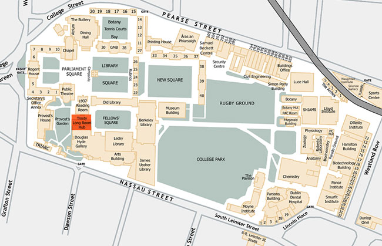

# **Delia McGrath**
>SID: A17242924

## About Me

I'm a study abroad student from **Trinity College Dublin** and am so excited to be here!

Looking at [what I do on a given school day](#a-typical-morning-in-dublin) will help paint a good picture as to who I am as a person/programmer.

but first, here's what my home university looks like without the rain--


# A Typical Morning in Dublin

# Schedule

- 08:00 wake-up
    > ~~Go back to sleep?~~ (no)
- 08:30 Head to tutorial
    - *Museum Building - Discrete*
- 10:00 Work on Computer [Assignments](#assignments) in the Hamilton Computer Labs
- 10:50 Go to the Sports Centre for a swim
- 11:30 Work on [Math](#math) in the [Ussher](ussher.md)
- 12:00 Meet up with friends at the Buttery

*Map to guide me around my day*


## Assignments

- [ ] Parallel Programming - finish testing Lab3
- [x] Architecture - Fix ALU
- [ ] Architecture - Add mux2to17 & testbench
- [x] [Software Engineering Project](https://github.com/bendunnegyms/AWS-Topology-Mapper) - finish adding serialisers to REST framework 
- [ ] Architecture - Double check binary is correct here: 
```
begin
    memory_m : process(IN_CAR)
        variable control_mem : mem_array := (
        "000000000110000000010000000100010001000000", -- 0 ADI
        "000000000110000000010000000000000011000000", -- 1 LDR
        "000000000110000000010000000000000000010000", -- 2 STR
        "000000000110000000010000000000001001000000", -- 3 INC
        "000000000110000000010000000001110001000000", -- 4 NOT
        "000000000110000000010000000000010001000000", -- 5 ADD
        "000000000100001100010000000000000011000000", -- 6 LRI
        "000000000100001111110000100000000001000000", -- 7 SR
        "000000000110000000010000000000000000000000", -- 8 catch
        "000000000001100001000000000000000000000000", -- 9 bEQ
        "000000000110000000010000000000000000000000", -- A catch
        "000000000001100001110000000000000000000000", -- B bnz
        "000000000110000000010000000000000000000000", -- C catch
        "000000000110000000010000100000100101000000", -- D CMP
            others => "000000000000000000000000000000000000000000"
        );
        variable addr : integer;
        variable control_out : std_logic_vector(41 downto 0);
```

## Math

1. Discrete - Work on problems **1a-1f**, review **3b**
2. Statistics - Compare **calculated** values to **automated** values on R