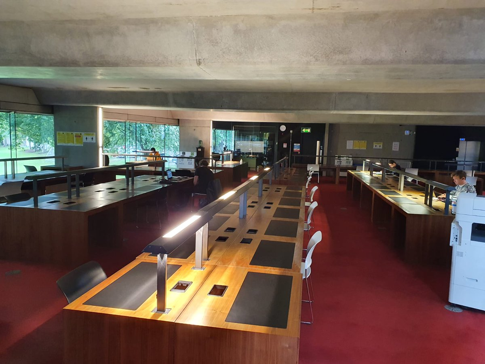

# Ussher Library
My favourite part of university is getting to study with a view, and quite honestly it's how I've made it to year three! 
Haha as a thank you for getting me through the years, I've dedicated this file to my favourite spot to study at Trinity. 

Here you can see we're off the ground! At this point I'm huffing and puffing from going up the five flights of stairs, but doing my best to pull myself together as the top floor is supposed to be silent.

Here's a better view of the spots to study because I spend most my time reading through code rather than the books.
